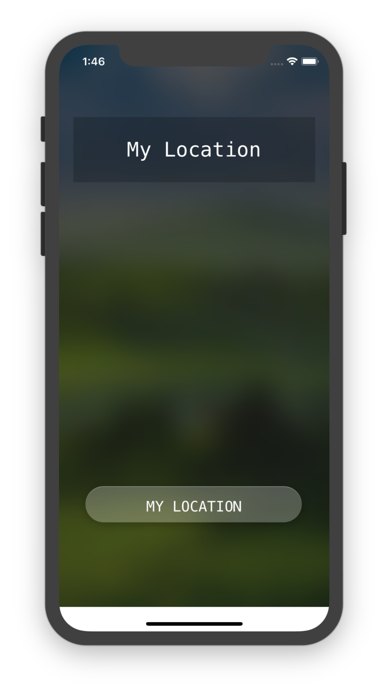

# iOS_Where-master
## 文件结构
```
.
├── .DS_Store
├── .git
│   ├── HEAD
│   ├── branches
│   ├── config
│   ├── description
│   ├── hooks
│   │   ├── applypatch-msg.sample
│   │   ├── commit-msg.sample
│   │   ├── fsmonitor-watchman.sample
│   │   ├── post-update.sample
│   │   ├── pre-applypatch.sample
│   │   ├── pre-commit.sample
│   │   ├── pre-push.sample
│   │   ├── pre-rebase.sample
│   │   ├── pre-receive.sample
│   │   ├── prepare-commit-msg.sample
│   │   └── update.sample
│   ├── info
│   │   └── exclude
│   ├── objects
│   │   ├── info
│   │   └── pack
│   └── refs
│       ├── heads
│       └── tags
├── Preview.png
├── README.md
├── Where
│   ├── .DS_Store
│   ├── .idea
│   │   ├── Where.iml
│   │   ├── inspectionProfiles
│   │   │   └── profiles_settings.xml
│   │   ├── misc.xml
│   │   ├── modules.xml
│   │   └── workspace.xml
│   ├── AppDelegate.swift
│   ├── Assets.xcassets
│   │   ├── .DS_Store
│   │   ├── AppIcon.appiconset
│   │   │   ├── 1024-1.png
│   │   │   ├── 1024.png
│   │   │   ├── 180.png
│   │   │   └── Contents.json
│   │   ├── Contents.json
│   │   ├── Find\ my\ location.imageset
│   │   │   ├── Contents.json
│   │   │   ├── Find\ my\ location.png
│   │   │   ├── Find\ my\ location@2x.png
│   │   │   └── Find\ my\ location@3x.png
│   │   └── bg.imageset
│   │       ├── .DS_Store
│   │       ├── Contents.json
│   │       └── bg.jpg
│   ├── Base.lproj
│   │   ├── LaunchScreen.storyboard
│   │   └── Main.storyboard
│   ├── Info.plist
│   ├── ViewController.swift
│   └── Where.xcdatamodeld
│       ├── .xccurrentversion
│       └── Where.xcdatamodel
│           └── contents
└── Where.xcodeproj
    ├── project.pbxproj
    ├── project.xcworkspace
    │   ├── contents.xcworkspacedata
    │   ├── xcshareddata
    │   │   └── IDEWorkspaceChecks.plist
    │   └── xcuserdata
    │       └── lightwingng.xcuserdatad
    │           └── UserInterfaceState.xcuserstate
    └── xcuserdata
        └── lightwingng.xcuserdatad
            └── xcschemes
                └── xcschememanagement.plist
```
## 运行效果


